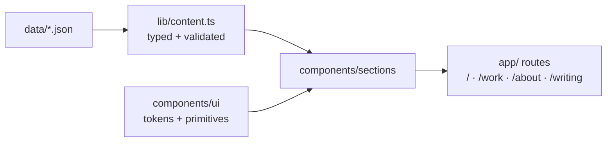

# aneeqhassan.com

Personal portfolio — and, progressively, a live demo of my AI engineering.
Phase 1: Obsidian/Prism design system. Phase 2: Postgres content. Phase 3:
an agent you can talk to (RAG + tools). Phase 4: writing + analytics.

## Stack

Next.js 15 (App Router) · React 19 · Tailwind 4 · TypeScript · Framer Motion ·
cmdk · Vitest · Docker · GitHub Actions · Vercel

## Run

```bash
docker compose up          # dev with hot reload → http://localhost:3000
docker compose exec web npm test        # unit tests
docker compose exec web npm run lint    # lint
docker compose exec web npm run typecheck  # type check
docker compose exec web npm run build   # build for production
```

## Architecture



Design decisions live in `STYLE_GUIDE.md` and `docs/superpowers/specs/`.
