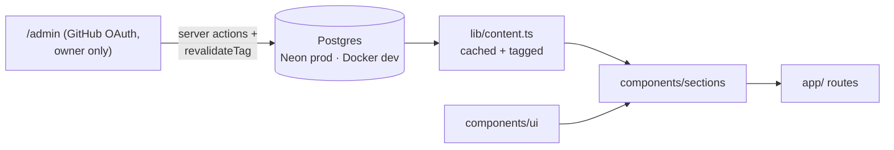

# aneeqhassan.com

Personal portfolio — and, progressively, a live demo of my AI engineering.
Phase 1: Obsidian/Prism design system. Phase 2: Postgres content. Phase 3:
an agent you can talk to (RAG + tools). Phase 4: writing + analytics.

## Stack

Next.js 15 (App Router) · React 19 · Tailwind 4 · TypeScript · Framer Motion ·
cmdk · Vitest · Docker · GitHub Actions · Vercel · Drizzle · Neon Postgres · Auth.js

## Run

```bash
docker compose up                        # dev + postgres → http://localhost:3000
docker compose exec web npm run lint     # lint
npx dotenv -e .env.local -- npm run db:migrate   # apply migrations (host)
npx dotenv -e .env.local -- npm run db:seed      # seed (insert-if-missing)
npx dotenv -e .env.local -- npm run db:studio    # browse the DB
```

## Architecture



Design decisions live in `STYLE_GUIDE.md` and `docs/superpowers/specs/`.
