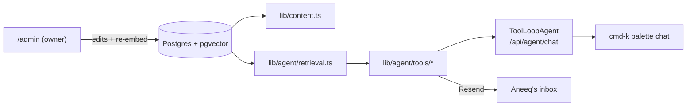

# aneeqhassan.com

Personal portfolio — and, progressively, a live demo of my AI engineering.
Phase 1: Obsidian/Prism design system. Phase 2: Postgres content. Phase 3:
an agent you can talk to (RAG + tools). Phase 4: writing + analytics.

## Stack

Next.js 15 (App Router) · React 19 · Tailwind 4 · TypeScript · Framer Motion ·
cmdk · Vitest · Docker · GitHub Actions · Vercel · Drizzle · Neon Postgres · Auth.js ·
AI SDK · AI Gateway (Claude Sonnet 4.6) · pgvector · Resend

## Run

```bash
npm run dev:local                        # FAST dev: postgres in Docker (kept warm) +
                                         # native Next.js/Turbopack → http://localhost:3000
                                         # (auto-refreshes the Vercel OIDC token each start)

# First run only — set up the local database once (the volume persists after):
npx dotenv -e .env.local -- npm run db:migrate   # apply migrations
npx dotenv -e .env.local -- npm run db:seed      # seed (insert-if-missing)
npx dotenv -e .env.local -- npm run db:embed     # embed the knowledge base

npm run db:studio                        # browse the DB
npm run db:reset                         # wipe + recreate the local DB volume
docker compose up                        # full-Docker parity build (CI/prod-like; slower)
```

## Deploy

Vercel builds statically prerender from the database, so **a reachable, migrated, seeded `DATABASE_URL` is required at build time** (Neon provides all envs automatically). This is deliberate — the build fails rather than shipping an empty portfolio.

One-time Vercel setup:

```bash
# 1. Add Neon integration (provisions DATABASE_URL automatically in Vercel env)
vercel integration add neon

# 2. Migrate + seed the production database
npx dotenv -e .env.vercel.production.local -- npm run db:migrate
npx dotenv -e .env.vercel.production.local -- npm run db:seed

# 3. Set auth env vars in Vercel dashboard (or via CLI):
#    AUTH_SECRET          — random secret (openssl rand -base64 32)
#    AUTH_GITHUB_ID       — GitHub OAuth App client ID
#    AUTH_GITHUB_SECRET   — GitHub OAuth App client secret
#    (admin access is hardcoded to the GitHub user HassanA01 in auth.ts)
#
# GitHub OAuth App settings:
#   Homepage URL:         https://aneeqhassan.com
#   Callback URL:         https://aneeqhassan.com/api/auth/callback/github
```

## Architecture



Design decisions live in `STYLE_GUIDE.md` and `docs/superpowers/specs/`.
