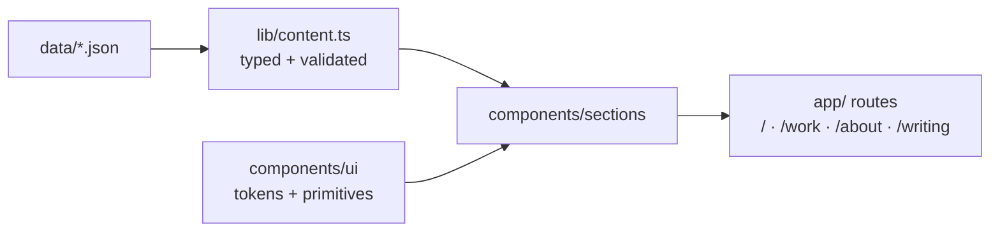

# Portfolio Redesign (Phase 1) Implementation Plan

> **For agentic workers:** REQUIRED SUB-SKILL: Use superpowers:subagent-driven-development (recommended) or superpowers:executing-plans to implement this plan task-by-task. Steps use checkbox (`- [ ]`) syntax for tracking.

**Goal:** Rebuild aneeqhassan.com ground-up with the Obsidian/Prism dual-theme design system, hybrid page structure (landing + /work + /about), floating glass nav with ⌘K palette, and full engineering scaffolding (Docker, CI, tests, GitHub issues).

**Architecture:** Design tokens (CSS variables + Tailwind 4 `@theme`) feed a small set of `components/ui` primitives, which compose into `components/sections`, which compose into App Router pages. Content is read only through a typed, validating `lib/content.ts` over the existing JSON (DB swaps in behind it in phase 2). Old components are deleted at the end, keeping the build green throughout.

**Tech Stack:** Next.js 15 (App Router, static rendering), React 19, Tailwind 4, TypeScript, Framer Motion, cmdk, Switzer (next/font/local) + IBM Plex Mono (next/font/google), Vitest + React Testing Library, Playwright, Docker, GitHub Actions.

**Spec:** `docs/superpowers/specs/2026-08-07-portfolio-redesign-design.md` — read it before starting any task.

## Global Constraints

- Color: semantic tokens only (`surface`, `surface-raised`, `ink`, `ink-muted`, `ink-faint`, `line`, `accent`). No raw hex in components.
- Accent appears ONLY in interaction states (hover, focus ring) and the agent presence dot. **Banned everywhere:** gradient text, glow effects, "AI badge" decorations, icon walls, carousels, typing animations, drop-shadow stacks.
- Fonts: Switzer for all UI/display type; IBM Plex Mono only for micro-details (section indices, timestamps, coordinates, tech tags).
- Motion: Framer Motion only; entrance fade-up staggers ≤200ms hovers; ALL motion respects `prefers-reduced-motion` (use the `Reveal` primitive or `useReducedMotion`).
- Copy voice: minimal, declarative, short lines. No paragraph walls.
- All commits: conventional format referencing the GitHub issue for the current epic chunk, e.g. `feat(#12): add design tokens`. Issue numbers come from Task 1 — record the mapping when created.
- Every task's work runs inside Docker once Task 2 lands (`docker compose exec web npm test` etc.); before that, run on host.
- Contact facts (use everywhere, never invent): email `hassan.aneeq01@gmail.com`, GitHub `https://github.com/HassanA01`, LinkedIn `https://linkedin.com/in/hassana01`, resume `/AneeqHassan.pdf`, location Toronto.
- 21st.dev Magic MCP: before building each `components/ui` and `components/sections` component, call `mcp__magic__21st_magic_component_inspiration` with a rich descriptor from STYLE_GUIDE.md for reference; scaffold with `mcp__magic__21st_magic_component_builder` when it helps, then restyle to our tokens. Never ship its output unmodified; the code in this plan is the source of truth for structure/behavior.

---

### Task 1: GitHub labels, epic, and issues

**Files:** none (GitHub state only)

**Interfaces:**
- Produces: issue numbers for each epic chunk. Record them in `.context/issues.md` as `chunk → #N` for later commit messages.

- [ ] **Step 1: Create labels** (ignore "already exists" errors)

```bash
for l in "epic|8250df" "feature|0e8a16" "bug|d73a4a" "chore|cfd3d7" "tech-debt|b60205" "blocked|000000" "in-progress|fbca04" "ready-for-review|0052cc" "mvp-critical|e11d21" "priority:high|b60205" "priority:medium|fbca04" "priority:low|c2e0c6" "size:S|c2e0c6" "size:M|fbca04" "size:L|b60205"; do
  gh label create "${l%%|*}" --color "${l##*|}" 2>/dev/null || true
done
```

- [ ] **Step 2: Create the epic and issues**

```bash
gh issue create --title "Epic: Phase 1 — Portfolio redesign (Obsidian/Prism)" --label epic,mvp-critical --body "Ground-up redesign per docs/superpowers/specs/2026-08-07-portfolio-redesign-design.md. Chunks tracked as child issues."

gh issue create --title "Engineering foundations: Docker, CI, test infra" --label feature,mvp-critical,size:M --body $'Acceptance:\n- Multi-stage Dockerfile (dev hot-reload + minimal prod), docker-compose with healthcheck\n- CI: lint, typecheck, vitest, build, docker build on every push/PR\n- Vitest + RTL configured, sample test green\n\nApproach: node:24-alpine, next.config standalone output, GitHub Actions.'

gh issue create --title "Design tokens, fonts, theme system" --label feature,mvp-critical,size:M --body $'Acceptance:\n- Semantic tokens as CSS vars + Tailwind 4 @theme (surface/ink/line/accent families)\n- Obsidian dark + Prism light, data-theme attr set pre-paint (no flash), localStorage override\n- Switzer self-hosted via next/font/local, IBM Plex Mono via next/font/google\n\nDepends on: foundations.'

gh issue create --title "Content layer: typed lib/content.ts over JSON" --label feature,mvp-critical,size:S --body $'Acceptance:\n- projects.json cleaned (no embedded HTML), featured flags\n- experience.json gains one-line impact per role\n- lib/content.ts validates at import and throws with context; components never touch raw JSON.'

gh issue create --title "UI primitives: GlassButton, Surface, Section, MonoDetail, Reveal, ThemeToggle" --label feature,mvp-critical,size:M --body $'Acceptance:\n- Apple-glass button (translucent fill, hairline border, inner top highlight, backdrop-blur) + ghost variant\n- Flat hairline cards w/ hover lift; Section wrapper with mono index\n- Reveal respects prefers-reduced-motion; ThemeToggle persists choice.'

gh issue create --title "Navigation: floating glass pill + ⌘K command palette" --label feature,mvp-critical,size:M --body $'Acceptance:\n- Top bar at rest; floating pill on scroll (hide/reveal by scroll direction); monogram · Work · About · Contact · ⌘K chip · theme toggle\n- cmdk palette: navigate, copy email, download resume, toggle theme; opens via chip and Cmd/Ctrl+K\n- Mobile sheet menu.'

gh issue create --title "Landing page sections" --label feature,mvp-critical,size:L --body $'Acceptance:\n- Hero (declarative headline, muted second line, disabled "Ask my agent" glass CTA with coming-soon tooltip, mono edge details)\n- Selected work (featured cards), experience snapshot timeline, about strip with punch numbers, contact strip + footer\n- Static rendering, Reveal entrances.'

gh issue create --title "/work, /about, /writing scaffold, error pages" --label feature,mvp-critical,size:M --body $'Acceptance:\n- /work grid from content layer; /about narrative + full timeline + grouped skills\n- /writing route exists, hidden from nav; error.tsx + not-found.tsx in new language.'

gh issue create --title "Cleanup: delete legacy components, prune deps" --label chore,size:S --body $'Delete old Hero/About/Projects/Skills/Header/Footer/Experience components; remove swiper, react-type-animation, react-icons, radix tabs; prune unused assets.'

gh issue create --title "Polish: Playwright smoke, a11y, responsive, docs" --label feature,size:M --body $'Acceptance:\n- Playwright smoke in CI (landing renders, nav works, palette opens)\n- Keyboard/focus pass, responsive pass at 375/768/1280\n- README + project CLAUDE.md rewritten.'
```

- [ ] **Step 3: Record the issue-number mapping**

Write `.context/issues.md` listing each chunk name → issue number printed by the commands above. All later commit messages reference these.

---

### Task 2: Engineering foundations — Docker, CI, test infrastructure

**Files:**
- Create: `Dockerfile`, `docker-compose.yml`, `.dockerignore`, `.github/workflows/ci.yml`, `vitest.config.ts`, `tests/setup.ts`, `tests/smoke.test.ts`, `.env.example`
- Modify: `next.config.ts`, `package.json` (scripts + devDeps)

**Interfaces:**
- Produces: `npm test` (vitest run), `npm run typecheck`, working `docker compose up`; CI running lint/typecheck/test/build/docker on push.

- [ ] **Step 1: Install test tooling**

```bash
npm i -D vitest @vitejs/plugin-react jsdom @testing-library/react @testing-library/jest-dom @testing-library/user-event vite-tsconfig-paths
```

- [ ] **Step 2: Configure Vitest**

`vitest.config.ts`:
```ts
import { defineConfig } from "vitest/config";
import react from "@vitejs/plugin-react";
import tsconfigPaths from "vite-tsconfig-paths";

export default defineConfig({
  plugins: [react(), tsconfigPaths()],
  test: {
    environment: "jsdom",
    setupFiles: ["./tests/setup.ts"],
    include: ["tests/**/*.test.{ts,tsx}"],
  },
});
```

`tests/setup.ts`:
```ts
import "@testing-library/jest-dom/vitest";
```

`tests/smoke.test.ts`:
```ts
import { describe, it, expect } from "vitest";

describe("test infra", () => {
  it("runs", () => {
    expect(1 + 1).toBe(2);
  });
});
```

`package.json` scripts — add:
```json
"test": "vitest run",
"test:watch": "vitest",
"typecheck": "tsc --noEmit"
```

- [ ] **Step 3: Run the sample test**

Run: `npm test` → Expected: 1 passed.

- [ ] **Step 4: Docker**

`next.config.ts`:
```ts
import type { NextConfig } from "next";

const nextConfig: NextConfig = {
  output: "standalone",
};

export default nextConfig;
```

`.dockerignore`:
```
node_modules
.next
.git
.superpowers
.context
docs
*.md
```

`Dockerfile`:
```dockerfile
FROM node:24-alpine AS deps
WORKDIR /app
COPY package.json package-lock.json ./
RUN npm ci

FROM deps AS dev
COPY . .
EXPOSE 3000
CMD ["npm", "run", "dev"]

FROM deps AS builder
COPY . .
RUN npm run build

FROM node:24-alpine AS prod
WORKDIR /app
ENV NODE_ENV=production
COPY --from=builder /app/.next/standalone ./
COPY --from=builder /app/.next/static ./.next/static
COPY --from=builder /app/public ./public
EXPOSE 3000
CMD ["node", "server.js"]
```

`docker-compose.yml`:
```yaml
services:
  web:
    build:
      context: .
      target: dev
    ports:
      - "3000:3000"
    volumes:
      - .:/app
      - /app/node_modules
      - /app/.next
    healthcheck:
      test: ["CMD", "wget", "-qO-", "http://localhost:3000"]
      interval: 15s
      timeout: 5s
      retries: 5
      start_period: 30s
```

`.env.example`:
```
# Phase 1 needs no environment variables. Placeholders arrive with phase 2 (DATABASE_URL) and phase 3 (AI keys).
```

- [ ] **Step 5: Verify the container**

Run: `docker compose build && docker compose up -d && sleep 25 && docker compose ps && curl -sf http://localhost:3000 >/dev/null && echo OK`
Expected: `OK`, service healthy. Then `docker compose down`.

- [ ] **Step 6: CI workflow**

`.github/workflows/ci.yml`:
```yaml
name: CI
on:
  push:
  pull_request:
    branches: [main]

jobs:
  checks:
    runs-on: ubuntu-latest
    steps:
      - uses: actions/checkout@v4
      - uses: actions/setup-node@v4
        with: { node-version: 24, cache: npm }
      - run: npm ci
      - run: npm run lint
      - run: npm run typecheck
      - run: npm test
      - run: npm run build
  docker:
    runs-on: ubuntu-latest
    steps:
      - uses: actions/checkout@v4
      - run: docker build --target prod .
```

- [ ] **Step 7: Full local gate, then commit**

Run: `npm run lint && npm run typecheck && npm test && npm run build`
Expected: all green.

```bash
git add Dockerfile docker-compose.yml .dockerignore .github vitest.config.ts tests .env.example next.config.ts package.json package-lock.json
git commit -m "ci(#<foundations-issue>): add Docker, CI pipeline, and Vitest infrastructure"
```

---

### Task 3: Design tokens, fonts, theme system

**Files:**
- Create: `app/fonts.ts`, `lib/theme.ts`, `public/fonts/switzer/*.woff2`, `tests/theme.test.ts`
- Modify: `app/globals.css` (replace), `app/layout.tsx` (replace)
- Test: `tests/theme.test.ts`

**Interfaces:**
- Produces: Tailwind classes `bg-surface`, `bg-surface-raised`, `text-ink`, `text-ink-muted`, `text-ink-faint`, `border-line`, `text-accent`, `font-sans`, `font-mono`; `lib/theme.ts` exporting `type Theme = "light" | "dark"`, `THEME_INIT_SCRIPT: string`, `applyTheme(t: Theme): void`, `getStoredTheme(): Theme | null`, `resolveTheme(): Theme`.

- [ ] **Step 1: Download Switzer**

```bash
mkdir -p public/fonts/switzer
css=$(curl -sA "Mozilla/5.0" "https://api.fontshare.com/v2/css?f[]=switzer@300,400,500,600,700&display=swap")
i=0
for w in 300 400 500 600 700; do
  url=$(echo "$css" | grep -A5 "font-weight: $w" | grep -Eo "https://[^)]+\.woff2" | head -1)
  curl -s "$url" -o "public/fonts/switzer/switzer-$w.woff2"
done
ls -la public/fonts/switzer   # expect 5 non-empty .woff2 files
```

If Fontshare blocks automation, download the Switzer family zip from fontshare.com manually and place the five weight woff2 files with the same names. Do not fall back to a different typeface.

- [ ] **Step 2: Write the failing theme test**

`tests/theme.test.ts`:
```ts
import { describe, it, expect, beforeEach } from "vitest";
import { applyTheme, getStoredTheme, resolveTheme } from "@/lib/theme";

describe("theme", () => {
  beforeEach(() => {
    localStorage.clear();
    document.documentElement.removeAttribute("data-theme");
  });

  it("applyTheme sets the attribute and persists", () => {
    applyTheme("dark");
    expect(document.documentElement.getAttribute("data-theme")).toBe("dark");
    expect(getStoredTheme()).toBe("dark");
  });

  it("resolveTheme prefers the stored value", () => {
    applyTheme("light");
    expect(resolveTheme()).toBe("light");
  });

  it("resolveTheme falls back to system preference when nothing stored", () => {
    // jsdom matchMedia is undefined; resolveTheme must not throw and defaults dark
    expect(resolveTheme()).toBe("dark");
  });
});
```

- [ ] **Step 3: Run it to make sure it fails**

Run: `npm test -- tests/theme.test.ts` → Expected: FAIL (module not found).

- [ ] **Step 4: Implement `lib/theme.ts`**

```ts
export type Theme = "light" | "dark";

const KEY = "theme";

export function getStoredTheme(): Theme | null {
  try {
    const t = localStorage.getItem(KEY);
    return t === "light" || t === "dark" ? t : null;
  } catch {
    return null;
  }
}

export function resolveTheme(): Theme {
  const stored = getStoredTheme();
  if (stored) return stored;
  try {
    if (typeof window.matchMedia === "function") {
      return window.matchMedia("(prefers-color-scheme: light)").matches ? "light" : "dark";
    }
  } catch {
    /* fall through */
  }
  return "dark";
}

export function applyTheme(theme: Theme): void {
  document.documentElement.setAttribute("data-theme", theme);
  try {
    localStorage.setItem(KEY, theme);
  } catch {
    /* private mode — attribute still applied */
  }
}

// Inlined in <head> so the theme lands before first paint. Keep in sync with resolveTheme.
export const THEME_INIT_SCRIPT = `(function(){try{var t=localStorage.getItem("theme");if(t!=="light"&&t!=="dark"){t=window.matchMedia("(prefers-color-scheme: light)").matches?"light":"dark"}document.documentElement.setAttribute("data-theme",t)}catch(e){document.documentElement.setAttribute("data-theme","dark")}})();`;
```

- [ ] **Step 5: Run tests**

Run: `npm test -- tests/theme.test.ts` → Expected: PASS.

- [ ] **Step 6: Fonts**

`app/fonts.ts`:
```ts
import localFont from "next/font/local";
import { IBM_Plex_Mono } from "next/font/google";

export const switzer = localFont({
  src: [
    { path: "../public/fonts/switzer/switzer-300.woff2", weight: "300" },
    { path: "../public/fonts/switzer/switzer-400.woff2", weight: "400" },
    { path: "../public/fonts/switzer/switzer-500.woff2", weight: "500" },
    { path: "../public/fonts/switzer/switzer-600.woff2", weight: "600" },
    { path: "../public/fonts/switzer/switzer-700.woff2", weight: "700" },
  ],
  variable: "--font-switzer",
  display: "swap",
});

export const plexMono = IBM_Plex_Mono({
  weight: ["400", "500"],
  subsets: ["latin"],
  variable: "--font-plex-mono",
  display: "swap",
});
```

- [ ] **Step 7: Tokens — replace `app/globals.css`**

```css
@import "tailwindcss";

:root {
  --surface: #fbfbfa;
  --surface-raised: #ffffff;
  --ink: #151517;
  --ink-muted: #6f6f6a;
  --ink-faint: #a3a39e;
  --line: rgba(21, 21, 23, 0.1);
  --accent: #6d28d9;
}

[data-theme="dark"] {
  --surface: #0a0a0b;
  --surface-raised: #111113;
  --ink: #ededf0;
  --ink-muted: #8f8f96;
  --ink-faint: #5c5c63;
  --line: rgba(255, 255, 255, 0.1);
  --accent: #34d399;
}

@theme inline {
  --color-surface: var(--surface);
  --color-surface-raised: var(--surface-raised);
  --color-ink: var(--ink);
  --color-ink-muted: var(--ink-muted);
  --color-ink-faint: var(--ink-faint);
  --color-line: var(--line);
  --color-accent: var(--accent);
  --font-sans: var(--font-switzer), ui-sans-serif, system-ui, sans-serif;
  --font-mono: var(--font-plex-mono), ui-monospace, monospace;
}

html {
  scroll-behavior: smooth;
}

body {
  background: var(--surface);
  color: var(--ink);
  font-family: var(--font-sans);
  -webkit-font-smoothing: antialiased;
}

:focus-visible {
  outline: 2px solid var(--accent);
  outline-offset: 2px;
}

::selection {
  background: var(--ink);
  color: var(--surface);
}
```

- [ ] **Step 8: Replace `app/layout.tsx`**

```tsx
import type { Metadata } from "next";
import Script from "next/script";
import { switzer, plexMono } from "./fonts";
import { THEME_INIT_SCRIPT } from "@/lib/theme";
import "./globals.css";

export const metadata: Metadata = {
  title: "Aneeq Hassan — AI Engineer",
  description: "AI engineer in Toronto. I build systems that think.",
};

export default function RootLayout({ children }: { children: React.ReactNode }) {
  return (
    <html lang="en" suppressHydrationWarning>
      <head>
        <Script id="theme-init" strategy="beforeInteractive">
          {THEME_INIT_SCRIPT}
        </Script>
      </head>
      <body className={`${switzer.variable} ${plexMono.variable} font-sans`}>
        {children}
      </body>
    </html>
  );
}
```

Note: the old layout imported other fonts/metadata — this replaces it entirely. The existing page still renders with old components until Task 7; that's fine as long as `npm run build` passes.

- [ ] **Step 9: Verify build + tests, commit**

Run: `npm run lint && npm run typecheck && npm test && npm run build` → all green.

```bash
git add app/globals.css app/layout.tsx app/fonts.ts lib/theme.ts public/fonts tests/theme.test.ts
git commit -m "feat(#<tokens-issue>): add design tokens, self-hosted fonts, pre-paint theme system"
```

---

### Task 4: Content layer

**Files:**
- Modify: `data/projects.json`, `data/experience.json`
- Create: `lib/content.ts`
- Test: `tests/content.test.ts`

**Interfaces:**
- Produces:
```ts
export type Project = {
  title: string; description: string; tech: string[];
  image: string; github: string; live: string; featured: boolean;
};
export type Experience = {
  title: string; company: string; duration: string; impact: string;
  techStack: string[]; highlights: string[];
};
export function getProjects(): Project[];
export function getFeaturedProjects(): Project[];
export function getExperience(): Experience[];
```

- [ ] **Step 1: Clean the data**

`data/projects.json`: strip every `<span class="font-semibold">` / `</span>` from descriptions (plain text, same words). Add `"featured": true` to **MailflowAI, B2W - UofT Hacks 12, BizReach Marketplace, Myriad CRO Landing Page**; `"featured": false` to the rest. (Spec names Fastrak as a flagship story, but it is an experience item — it leads the experience snapshot instead.)

`data/experience.json`: add an `impact` one-liner to each role (used by the landing timeline; keep `highlights` for /about):
- Dayforce → `"Built QueryGPT — agentic natural-language SQL over 50K+ tables."`
- Mercor → `"Code review for the GitHub CLI and Airtable API in Go."`
- Learning Mode AI → `"Shipped a real-time, AI-generated quiz service in Go."`
- Magnet Forensics → `"Cut GrayKey usage per phone by 85% with Fastrak (.NET)."`
- Annaly → `"ETL notifier that cut incident response time by 95%."`
- Enbridge → `"Internal Power Apps tool; 75% faster cross-team communication."`
- Koho Financial → `"Google Pay integration processing $2M in its first quarter."`
- University of Toronto → `"Taught 2,000+ students data structures and algorithms."`

- [ ] **Step 2: Write the failing test**

`tests/content.test.ts`:
```ts
import { describe, it, expect } from "vitest";
import { getProjects, getFeaturedProjects, getExperience } from "@/lib/content";

describe("content layer", () => {
  it("returns all projects with required fields", () => {
    const projects = getProjects();
    expect(projects.length).toBeGreaterThanOrEqual(8);
    for (const p of projects) {
      expect(p.title).toBeTruthy();
      expect(p.description).not.toMatch(/<[^>]+>/); // no embedded HTML
      expect(p.image).toMatch(/^\//);
      expect(Array.isArray(p.tech)).toBe(true);
      expect(typeof p.featured).toBe("boolean");
    }
  });

  it("returns exactly the featured projects", () => {
    const titles = getFeaturedProjects().map((p) => p.title);
    expect(titles).toContain("MailflowAI");
    expect(titles).toHaveLength(4);
  });

  it("returns experience with impact lines", () => {
    const exp = getExperience();
    expect(exp[0].company).toBe("Dayforce");
    for (const e of exp) {
      expect(e.impact).toBeTruthy();
      expect(e.highlights.length).toBeGreaterThan(0);
    }
  });
});
```

- [ ] **Step 3: Run it to verify failure**

Run: `npm test -- tests/content.test.ts` → Expected: FAIL (module not found).

- [ ] **Step 4: Implement `lib/content.ts`**

```ts
import projectsJson from "@/data/projects.json";
import experienceJson from "@/data/experience.json";

export type Project = {
  title: string;
  description: string;
  tech: string[];
  image: string;
  github: string;
  live: string;
  featured: boolean;
};

export type Experience = {
  title: string;
  company: string;
  duration: string;
  impact: string;
  techStack: string[];
  highlights: string[];
};

function fail(context: string, detail: string): never {
  throw new Error(`content: invalid ${context} — ${detail}`);
}

function validateProject(raw: unknown, index: number): Project {
  const p = raw as Partial<Project>;
  if (!p.title) fail(`project[${index}]`, "missing title");
  if (!p.description || /<[^>]+>/.test(p.description))
    fail(`project "${p.title}"`, "description missing or contains HTML");
  if (!p.image?.startsWith("/")) fail(`project "${p.title}"`, "image must be a /public path");
  if (!Array.isArray(p.tech) || p.tech.length === 0) fail(`project "${p.title}"`, "tech must be non-empty");
  if (typeof p.featured !== "boolean") fail(`project "${p.title}"`, "featured flag missing");
  return p as Project;
}

function validateExperience(raw: unknown, index: number): Experience {
  const e = raw as Partial<Experience>;
  if (!e.company || !e.title) fail(`experience[${index}]`, "missing company or title");
  if (!e.impact) fail(`experience "${e.company}"`, "missing impact one-liner");
  if (!Array.isArray(e.highlights) || e.highlights.length === 0)
    fail(`experience "${e.company}"`, "highlights must be non-empty");
  if (!Array.isArray(e.techStack)) fail(`experience "${e.company}"`, "techStack must be an array");
  if (!e.duration) fail(`experience "${e.company}"`, "missing duration");
  return e as Experience;
}

const projects: Project[] = (projectsJson as unknown[]).map(validateProject);
const experience: Experience[] = (
  (experienceJson as { experience: unknown[] }).experience
).map(validateExperience);

export function getProjects(): Project[] {
  return projects;
}

export function getFeaturedProjects(): Project[] {
  return projects.filter((p) => p.featured);
}

export function getExperience(): Experience[] {
  return experience;
}
```

- [ ] **Step 5: Run tests, fix data until green**

Run: `npm test -- tests/content.test.ts` → Expected: PASS. A failure here means the JSON edit in Step 1 is incomplete — fix the data, not the validator.

- [ ] **Step 6: Verify old components still compile** (they import the JSON directly until Task 7)

Run: `npm run build` → Expected: success. If `Projects.tsx` breaks because it rendered the removed `<span>` HTML via `dangerouslySetInnerHTML`, leave the component as-is (plain text renders fine) unless the build fails.

- [ ] **Step 7: Commit**

```bash
git add data/projects.json data/experience.json lib/content.ts tests/content.test.ts
git commit -m "feat(#<content-issue>): add validated content layer, clean data files"
```

---

### Task 5: UI primitives — GlassButton, Surface, Section, MonoDetail, Reveal, ThemeToggle

**Files:**
- Create: `lib/utils.ts`, `components/ui/GlassButton.tsx`, `components/ui/Surface.tsx`, `components/ui/Section.tsx`, `components/ui/MonoDetail.tsx`, `components/ui/Reveal.tsx`, `components/ui/ThemeToggle.tsx`
- Test: `tests/primitives.test.tsx`

**Interfaces:**
- Consumes: theme tokens (Task 3), `applyTheme`/`resolveTheme` (Task 3).
- Produces:
  - `cn(...inputs: ClassValue[]): string`
  - `<GlassButton variant?: "glass" | "ghost", href?: string, disabled?: boolean, disabledHint?: string>` — renders `<a>` when `href`, else `<button>`; when `disabled` + `disabledHint`, shows the hint on hover/focus via `title` and `aria-disabled`.
  - `<Surface as?: ElementType, interactive?: boolean>` — flat card, hairline border; `interactive` adds hover border-brighten + translate.
  - `<Section id: string, index: string, title: string>` — wrapper with mono index (`01`) + heading.
  - `<MonoDetail>` — tiny mono text, `text-ink-faint`.
  - `<Reveal delay?: number>` — fade-up on scroll into view; respects reduced motion.
  - `<ThemeToggle />` — button toggling and persisting theme.

- [ ] **Step 1: Get inspiration** — `mcp__magic__21st_magic_component_inspiration` query: "minimal glassmorphism button hairline border dark theme restrained Apple style". Reference only.

- [ ] **Step 2: Write failing tests**

`tests/primitives.test.tsx`:
```tsx
import { describe, it, expect, beforeEach } from "vitest";
import { render, screen } from "@testing-library/react";
import userEvent from "@testing-library/user-event";
import { GlassButton } from "@/components/ui/GlassButton";
import { ThemeToggle } from "@/components/ui/ThemeToggle";

describe("GlassButton", () => {
  it("renders an anchor when href is given", () => {
    render(<GlassButton href="/work">View work</GlassButton>);
    expect(screen.getByRole("link", { name: "View work" })).toHaveAttribute("href", "/work");
  });

  it("renders a disabled button with hint", () => {
    render(<GlassButton disabled disabledHint="Coming soon">Ask my agent</GlassButton>);
    const btn = screen.getByRole("button", { name: "Ask my agent" });
    expect(btn).toHaveAttribute("aria-disabled", "true");
    expect(btn).toHaveAttribute("title", "Coming soon");
  });
});

describe("ThemeToggle", () => {
  beforeEach(() => {
    localStorage.clear();
    document.documentElement.setAttribute("data-theme", "dark");
  });

  it("toggles the theme and persists", async () => {
    render(<ThemeToggle />);
    await userEvent.click(screen.getByRole("button"));
    expect(document.documentElement.getAttribute("data-theme")).toBe("light");
    expect(localStorage.getItem("theme")).toBe("light");
  });
});
```

- [ ] **Step 3: Run to verify failure** — `npm test -- tests/primitives.test.tsx` → FAIL (modules missing).

- [ ] **Step 4: Implement**

`lib/utils.ts`:
```ts
import { clsx, type ClassValue } from "clsx";
import { twMerge } from "tailwind-merge";

export function cn(...inputs: ClassValue[]) {
  return twMerge(clsx(inputs));
}
```

`components/ui/GlassButton.tsx`:
```tsx
import Link from "next/link";
import { cn } from "@/lib/utils";

type Props = {
  variant?: "glass" | "ghost";
  href?: string;
  disabled?: boolean;
  disabledHint?: string;
  onClick?: () => void;
  className?: string;
  children: React.ReactNode;
};

const base =
  "inline-flex items-center gap-2 rounded-full text-sm font-medium transition-colors duration-150 focus-visible:outline-2";

const variants = {
  glass:
    "px-5 py-2.5 bg-ink/5 border border-ink/15 shadow-[inset_0_1px_0_rgba(255,255,255,0.25)] backdrop-blur-md hover:border-ink/30 [data-theme=dark]_&:shadow-[inset_0_1px_0_rgba(255,255,255,0.12)]",
  ghost: "px-1 py-2 text-ink-muted hover:text-ink",
};

export function GlassButton({
  variant = "glass",
  href,
  disabled,
  disabledHint,
  onClick,
  className,
  children,
}: Props) {
  const classes = cn(base, variants[variant], disabled && "opacity-50 cursor-not-allowed", className);
  if (href && !disabled) {
    return (
      <Link href={href} className={classes} onClick={onClick}>
        {children}
      </Link>
    );
  }
  return (
    <button
      type="button"
      className={classes}
      aria-disabled={disabled || undefined}
      title={disabled ? disabledHint : undefined}
      onClick={disabled ? undefined : onClick}
    >
      {children}
    </button>
  );
}
```

`components/ui/Surface.tsx`:
```tsx
import { cn } from "@/lib/utils";

type Props<T extends React.ElementType> = {
  as?: T;
  interactive?: boolean;
  className?: string;
  children: React.ReactNode;
} & Omit<React.ComponentPropsWithoutRef<T>, "as" | "className" | "children">;

export function Surface<T extends React.ElementType = "div">({
  as,
  interactive,
  className,
  children,
  ...rest
}: Props<T>) {
  const Comp = as ?? "div";
  return (
    <Comp
      className={cn(
        "rounded-xl border border-line bg-surface-raised p-6",
        interactive &&
          "transition-[border-color,transform] duration-200 hover:border-ink/25 hover:-translate-y-0.5",
        className,
      )}
      {...rest}
    >
      {children}
    </Comp>
  );
}
```

`components/ui/Section.tsx`:
```tsx
import { MonoDetail } from "./MonoDetail";

type Props = {
  id: string;
  index: string;
  title: string;
  children: React.ReactNode;
};

export function Section({ id, index, title, children }: Props) {
  return (
    <section id={id} className="mx-auto w-full max-w-5xl px-6 py-24">
      <div className="mb-10 flex items-baseline gap-4">
        <MonoDetail>{index}</MonoDetail>
        <h2 className="text-xl font-medium tracking-tight text-ink">{title}</h2>
      </div>
      {children}
    </section>
  );
}
```

`components/ui/MonoDetail.tsx`:
```tsx
import { cn } from "@/lib/utils";

export function MonoDetail({
  className,
  children,
}: {
  className?: string;
  children: React.ReactNode;
}) {
  return (
    <span className={cn("font-mono text-[11px] uppercase tracking-[0.14em] text-ink-faint", className)}>
      {children}
    </span>
  );
}
```

`components/ui/Reveal.tsx`:
```tsx
"use client";

import { motion, useReducedMotion } from "framer-motion";

export function Reveal({
  delay = 0,
  className,
  children,
}: {
  delay?: number;
  className?: string;
  children: React.ReactNode;
}) {
  const reduce = useReducedMotion();
  if (reduce) return <div className={className}>{children}</div>;
  return (
    <motion.div
      className={className}
      initial={{ opacity: 0, y: 16 }}
      whileInView={{ opacity: 1, y: 0 }}
      viewport={{ once: true, margin: "-80px" }}
      transition={{ duration: 0.5, delay, ease: [0.21, 0.47, 0.32, 0.98] }}
    >
      {children}
    </motion.div>
  );
}
```

`components/ui/ThemeToggle.tsx`:
```tsx
"use client";

import { useEffect, useState } from "react";
import { Moon, Sun } from "lucide-react";
import { applyTheme, resolveTheme, type Theme } from "@/lib/theme";

export function ThemeToggle() {
  const [theme, setTheme] = useState<Theme | null>(null);

  useEffect(() => setTheme(resolveTheme()), []);

  const next: Theme = theme === "dark" ? "light" : "dark";
  return (
    <button
      type="button"
      aria-label={`Switch to ${next} theme`}
      className="rounded-full p-2 text-ink-muted transition-colors hover:text-ink"
      onClick={() => {
        applyTheme(next);
        setTheme(next);
      }}
    >
      {theme === "light" ? <Moon size={16} /> : <Sun size={16} />}
    </button>
  );
}
```

- [ ] **Step 5: Run tests** — `npm test -- tests/primitives.test.tsx` → PASS.

- [ ] **Step 6: Gate + commit**

Run: `npm run lint && npm run typecheck && npm test && npm run build` → green.

```bash
git add lib/utils.ts components/ui tests/primitives.test.tsx
git commit -m "feat(#<primitives-issue>): add glass/surface/section/reveal/theme primitives"
```

---

### Task 6: Navigation — floating glass pill + ⌘K command palette

**Files:**
- Create: `components/ui/NavPill.tsx`, `components/ui/CommandPalette.tsx`
- Modify: `app/layout.tsx` (mount nav)
- Test: `tests/nav.test.tsx`

**Interfaces:**
- Consumes: `cn`, `ThemeToggle`, `MonoDetail`, `applyTheme`/`resolveTheme`.
- Produces: `<NavPill />` (client, self-contained, includes palette trigger + `<CommandPalette>`); `<CommandPalette open, onOpenChange>` controlled dialog.

- [ ] **Step 1: Install cmdk; try the Aceternity reference**

```bash
npm i cmdk
npx shadcn@latest add @aceternity/floating-navbar-demo || true
```

If the shadcn command succeeds it lands a demo component — treat it as reference for the scroll-direction hide/reveal mechanics, then **delete the demo files** after building ours (our tokens, no accent borders). If it fails (no components.json), skip it; the implementation below is complete.

- [ ] **Step 2: Write failing tests**

`tests/nav.test.tsx`:
```tsx
import { describe, it, expect, vi } from "vitest";
import { render, screen } from "@testing-library/react";
import userEvent from "@testing-library/user-event";
import { NavPill } from "@/components/ui/NavPill";

vi.mock("next/navigation", () => ({
  useRouter: () => ({ push: vi.fn() }),
  usePathname: () => "/",
}));

describe("NavPill", () => {
  it("renders nav links and the ⌘K chip", () => {
    render(<NavPill />);
    expect(screen.getByRole("link", { name: "Work" })).toHaveAttribute("href", "/work");
    expect(screen.getByRole("link", { name: "About" })).toHaveAttribute("href", "/about");
    expect(screen.getByRole("link", { name: "Contact" })).toHaveAttribute("href", "/#contact");
    expect(screen.getByRole("button", { name: /command menu/i })).toBeInTheDocument();
  });

  it("opens the palette with Cmd+K", async () => {
    render(<NavPill />);
    await userEvent.keyboard("{Meta>}k{/Meta}");
    expect(screen.getByPlaceholderText(/type a command/i)).toBeInTheDocument();
  });

  it("palette lists quick actions", async () => {
    render(<NavPill />);
    await userEvent.click(screen.getByRole("button", { name: /command menu/i }));
    expect(screen.getByText("Copy email")).toBeInTheDocument();
    expect(screen.getByText("Download resume")).toBeInTheDocument();
    expect(screen.getByText("Toggle theme")).toBeInTheDocument();
  });
});
```

- [ ] **Step 3: Run to verify failure** — `npm test -- tests/nav.test.tsx` → FAIL.

- [ ] **Step 4: Implement `components/ui/CommandPalette.tsx`**

```tsx
"use client";

import { useRouter } from "next/navigation";
import { Command } from "cmdk";
import { applyTheme, resolveTheme } from "@/lib/theme";

type Props = { open: boolean; onOpenChange: (open: boolean) => void };

export function CommandPalette({ open, onOpenChange }: Props) {
  const router = useRouter();

  const run = (fn: () => void) => {
    fn();
    onOpenChange(false);
  };

  return (
    <Command.Dialog
      open={open}
      onOpenChange={onOpenChange}
      label="Command menu"
      className="fixed left-1/2 top-28 z-50 w-[min(560px,90vw)] -translate-x-1/2 overflow-hidden rounded-xl border border-line bg-surface-raised/90 shadow-2xl shadow-black/20 backdrop-blur-xl"
    >
      <Command.Input
        placeholder="Type a command…"
        className="w-full border-b border-line bg-transparent px-4 py-3 text-sm text-ink outline-none placeholder:text-ink-faint"
      />
      <Command.List className="max-h-72 overflow-y-auto p-2">
        <Command.Empty className="px-3 py-6 text-center text-sm text-ink-faint">
          Nothing found.
        </Command.Empty>
        <Command.Group heading="Go to" className="px-1 py-1 font-mono text-[10px] uppercase tracking-[0.14em] text-ink-faint">
          <Item onSelect={() => run(() => router.push("/"))}>Home</Item>
          <Item onSelect={() => run(() => router.push("/work"))}>Work</Item>
          <Item onSelect={() => run(() => router.push("/about"))}>About</Item>
          <Item onSelect={() => run(() => router.push("/#contact"))}>Contact</Item>
        </Command.Group>
        <Command.Group heading="Actions" className="px-1 py-1 font-mono text-[10px] uppercase tracking-[0.14em] text-ink-faint">
          <Item onSelect={() => run(() => navigator.clipboard?.writeText("hassan.aneeq01@gmail.com"))}>
            Copy email
          </Item>
          <Item onSelect={() => run(() => window.open("/AneeqHassan.pdf", "_blank"))}>
            Download resume
          </Item>
          <Item onSelect={() => run(() => applyTheme(resolveTheme() === "dark" ? "light" : "dark"))}>
            Toggle theme
          </Item>
        </Command.Group>
      </Command.List>
    </Command.Dialog>
  );
}

function Item({ onSelect, children }: { onSelect: () => void; children: React.ReactNode }) {
  return (
    <Command.Item
      onSelect={onSelect}
      className="cursor-pointer rounded-md px-3 py-2 font-sans text-sm normal-case tracking-normal text-ink aria-selected:bg-ink/5"
    >
      {children}
    </Command.Item>
  );
}
```

- [ ] **Step 5: Implement `components/ui/NavPill.tsx`**

```tsx
"use client";

import { useEffect, useState } from "react";
import Link from "next/link";
import { motion, AnimatePresence, useScroll, useMotionValueEvent } from "framer-motion";
import { CommandPalette } from "./CommandPalette";
import { ThemeToggle } from "./ThemeToggle";
import { cn } from "@/lib/utils";

const LINKS = [
  { href: "/work", label: "Work" },
  { href: "/about", label: "About" },
  { href: "/#contact", label: "Contact" },
] as const;

export function NavPill() {
  const [paletteOpen, setPaletteOpen] = useState(false);
  const [mode, setMode] = useState<"bar" | "pill-visible" | "pill-hidden">("bar");
  const { scrollY } = useScroll();

  useMotionValueEvent(scrollY, "change", (y) => {
    const prev = scrollY.getPrevious() ?? 0;
    if (y < 80) setMode("bar");
    else setMode(y < prev ? "pill-visible" : "pill-hidden");
  });

  useEffect(() => {
    const onKey = (e: KeyboardEvent) => {
      if (e.key === "k" && (e.metaKey || e.ctrlKey)) {
        e.preventDefault();
        setPaletteOpen((o) => !o);
      }
    };
    window.addEventListener("keydown", onKey);
    return () => window.removeEventListener("keydown", onKey);
  }, []);

  const inner = (pill: boolean) => (
    <>
      <Link href="/" className="font-semibold tracking-tight text-ink">
        {pill ? "AH" : "Aneeq Hassan"}
      </Link>
      <div className="flex items-center gap-1">
        {LINKS.map((l) => (
          <Link
            key={l.href}
            href={l.href}
            className="rounded-full px-3 py-1.5 text-sm text-ink-muted transition-colors hover:text-ink"
          >
            {l.label}
          </Link>
        ))}
        <button
          type="button"
          aria-label="Open command menu"
          onClick={() => setPaletteOpen(true)}
          className="mx-1 rounded-full border border-line px-2.5 py-1 font-mono text-[11px] text-ink-muted transition-colors hover:border-ink/25 hover:text-ink"
        >
          ⌘K
        </button>
        <ThemeToggle />
      </div>
    </>
  );

  return (
    <>
      {/* Resting top bar */}
      <header
        className={cn(
          "fixed inset-x-0 top-0 z-40 transition-opacity duration-200",
          mode === "bar" ? "opacity-100" : "pointer-events-none opacity-0",
        )}
      >
        <div className="mx-auto flex w-full max-w-5xl items-center justify-between px-6 py-5">
          {inner(false)}
        </div>
      </header>

      {/* Floating pill */}
      <AnimatePresence>
        {mode === "pill-visible" && (
          <motion.nav
            key="pill"
            initial={{ y: -80, opacity: 0 }}
            animate={{ y: 0, opacity: 1 }}
            exit={{ y: -80, opacity: 0 }}
            transition={{ duration: 0.25, ease: "easeOut" }}
            className="fixed left-1/2 top-4 z-40 flex -translate-x-1/2 items-center gap-2 rounded-full border border-line bg-surface-raised/80 py-1.5 pl-4 pr-2 shadow-[inset_0_1px_0_rgba(255,255,255,0.08)] backdrop-blur-xl"
          >
            {inner(true)}
          </motion.nav>
        )}
      </AnimatePresence>

      <CommandPalette open={paletteOpen} onOpenChange={setPaletteOpen} />
    </>
  );
}
```

Note on mobile: the three links + chip fit at 375px because pill labels are short; verify in the Task 10 responsive pass and, if cramped, collapse LINKS behind a `Menu` (lucide) button that opens the palette instead — the palette already navigates.

- [ ] **Step 6: Mount in `app/layout.tsx`** — inside `<body>`, before `{children}`:

```tsx
import { NavPill } from "@/components/ui/NavPill";
// …
<body className={`${switzer.variable} ${plexMono.variable} font-sans`}>
  <NavPill />
  {children}
</body>
```

- [ ] **Step 7: Run tests** — `npm test -- tests/nav.test.tsx` → PASS. (cmdk renders in jsdom; if the dialog portal misses, add `container: document.body` render option.)

- [ ] **Step 8: Gate + commit**

Run: `npm run lint && npm run typecheck && npm test && npm run build` → green.

```bash
git add components/ui/NavPill.tsx components/ui/CommandPalette.tsx app/layout.tsx tests/nav.test.tsx package.json package-lock.json
git commit -m "feat(#<nav-issue>): add floating glass nav pill and cmd-k palette"
```

---

### Task 7: Landing page — Hero + SelectedWork

**Files:**
- Create: `components/sections/Hero.tsx`, `components/sections/SelectedWork.tsx`
- Modify: `app/page.tsx` (replace entirely)
- Test: `tests/landing.test.tsx`

**Interfaces:**
- Consumes: `GlassButton`, `Surface`, `Section`, `MonoDetail`, `Reveal`, `getFeaturedProjects`.
- Produces: `<Hero />`, `<SelectedWork />` (server components; Reveal handles client motion).

- [ ] **Step 1: Write failing tests**

`tests/landing.test.tsx`:
```tsx
import { describe, it, expect } from "vitest";
import { render, screen } from "@testing-library/react";
import { Hero } from "@/components/sections/Hero";
import { SelectedWork } from "@/components/sections/SelectedWork";

describe("Hero", () => {
  it("renders the headline and CTAs", () => {
    render(<Hero />);
    expect(screen.getByRole("heading", { level: 1 })).toHaveTextContent("AI engineer.");
    const agentBtn = screen.getByRole("button", { name: "Ask my agent" });
    expect(agentBtn).toHaveAttribute("aria-disabled", "true");
    expect(agentBtn).toHaveAttribute("title", "Coming soon");
    expect(screen.getByRole("link", { name: /view work/i })).toHaveAttribute("href", "/work");
  });
});

describe("SelectedWork", () => {
  it("renders the four featured projects", () => {
    render(<SelectedWork />);
    expect(screen.getByText("MailflowAI")).toBeInTheDocument();
    expect(screen.getAllByRole("listitem")).toHaveLength(4);
    expect(screen.getByRole("link", { name: /all work/i })).toHaveAttribute("href", "/work");
  });
});
```

- [ ] **Step 2: Run to verify failure** — `npm test -- tests/landing.test.tsx` → FAIL.

- [ ] **Step 3: Implement `components/sections/Hero.tsx`**

```tsx
import { GlassButton } from "@/components/ui/GlassButton";
import { MonoDetail } from "@/components/ui/MonoDetail";
import { Reveal } from "@/components/ui/Reveal";

export function Hero() {
  return (
    <section className="mx-auto flex min-h-[92vh] w-full max-w-5xl flex-col justify-center px-6 pt-24">
      <Reveal>
        <h1 className="text-5xl font-medium leading-[1.05] tracking-[-0.035em] text-ink sm:text-6xl">
          AI engineer.
          <br />
          <span className="text-ink-faint">I build systems that think.</span>
        </h1>
      </Reveal>
      <Reveal delay={0.1}>
        <p className="mt-6 max-w-md text-base leading-relaxed text-ink-muted">
          Currently at Dayforce, building agentic applications. Previously Magnet
          Forensics, Koho, and five other teams.
        </p>
      </Reveal>
      <Reveal delay={0.2}>
        <div className="mt-10 flex items-center gap-6">
          <GlassButton disabled disabledHint="Coming soon">
            Ask my agent
          </GlassButton>
          <GlassButton variant="ghost" href="/work">
            View work →
          </GlassButton>
        </div>
      </Reveal>
      <div className="mt-auto flex justify-between pb-8 pt-16">
        <MonoDetail>Toronto — 43.65°N</MonoDetail>
        <MonoDetail>EST</MonoDetail>
      </div>
    </section>
  );
}
```

- [ ] **Step 4: Implement `components/sections/SelectedWork.tsx`**

```tsx
import { Section } from "@/components/ui/Section";
import { Surface } from "@/components/ui/Surface";
import { MonoDetail } from "@/components/ui/MonoDetail";
import { Reveal } from "@/components/ui/Reveal";
import { GlassButton } from "@/components/ui/GlassButton";
import { getFeaturedProjects } from "@/lib/content";

export function SelectedWork() {
  const projects = getFeaturedProjects();
  return (
    <Section id="work" index="01" title="Selected work">
      <ul className="grid gap-4 sm:grid-cols-2">
        {projects.map((p, i) => (
          <Reveal key={p.title} delay={i * 0.06}>
            <Surface as="li" interactive className="flex h-full flex-col">
              <h3 className="text-base font-medium text-ink">{p.title}</h3>
              <p className="mt-2 flex-1 text-sm leading-relaxed text-ink-muted">{p.description}</p>
              <div className="mt-4 flex flex-wrap gap-x-3 gap-y-1">
                {p.tech.slice(0, 4).map((t) => (
                  <MonoDetail key={t}>{t}</MonoDetail>
                ))}
              </div>
              <div className="mt-4 flex gap-4 text-sm">
                <a href={p.github} className="text-ink-muted transition-colors hover:text-ink" target="_blank" rel="noreferrer">
                  GitHub →
                </a>
                {p.live && (
                  <a href={p.live} className="text-ink-muted transition-colors hover:text-ink" target="_blank" rel="noreferrer">
                    Live →
                  </a>
                )}
              </div>
            </Surface>
          </Reveal>
        ))}
      </ul>
      <div className="mt-8">
        <GlassButton variant="ghost" href="/work">
          All work →
        </GlassButton>
      </div>
    </Section>
  );
}
```

- [ ] **Step 5: Replace `app/page.tsx`** (old sections removed from the page now; files deleted in Task 9)

```tsx
import { Hero } from "@/components/sections/Hero";
import { SelectedWork } from "@/components/sections/SelectedWork";

export default function Home() {
  return (
    <main>
      <Hero />
      <SelectedWork />
    </main>
  );
}
```

- [ ] **Step 6: Run tests** — `npm test -- tests/landing.test.tsx` → PASS.

- [ ] **Step 7: Gate + commit**

Run: `npm run lint && npm run typecheck && npm test && npm run build` → green.

```bash
git add components/sections app/page.tsx tests/landing.test.tsx
git commit -m "feat(#<landing-issue>): add hero and selected work sections"
```

---

### Task 8: Landing page — ExperienceTimeline, AboutStrip, ContactStrip + footer

**Files:**
- Create: `components/sections/ExperienceTimeline.tsx`, `components/sections/AboutStrip.tsx`, `components/sections/ContactStrip.tsx`
- Modify: `app/page.tsx`
- Test: `tests/landing-lower.test.tsx`

**Interfaces:**
- Consumes: `Section`, `MonoDetail`, `Reveal`, `getExperience`.
- Produces: `<ExperienceTimeline compact?: boolean />` — compact (landing: impact line only) vs full (/about: highlight bullets); `<AboutStrip />`, `<ContactStrip />` (includes the site footer).

- [ ] **Step 1: Write failing tests**

`tests/landing-lower.test.tsx`:
```tsx
import { describe, it, expect } from "vitest";
import { render, screen } from "@testing-library/react";
import { ExperienceTimeline } from "@/components/sections/ExperienceTimeline";
import { ContactStrip } from "@/components/sections/ContactStrip";

describe("ExperienceTimeline", () => {
  it("compact mode lists every role with its impact line, no bullets", () => {
    render(<ExperienceTimeline compact />);
    expect(screen.getByText("Dayforce")).toBeInTheDocument();
    expect(screen.getByText(/QueryGPT/)).toBeInTheDocument();
    expect(screen.queryByRole("list", { name: /highlights/i })).not.toBeInTheDocument();
  });

  it("full mode renders highlight bullets", () => {
    render(<ExperienceTimeline />);
    expect(screen.getAllByRole("list", { name: /highlights/i }).length).toBeGreaterThan(0);
  });
});

describe("ContactStrip", () => {
  it("renders email, socials, and resume", () => {
    render(<ContactStrip />);
    expect(screen.getByRole("link", { name: /hassan\.aneeq01@gmail\.com/i })).toHaveAttribute(
      "href",
      "mailto:hassan.aneeq01@gmail.com",
    );
    expect(screen.getByRole("link", { name: /github/i })).toHaveAttribute("href", "https://github.com/HassanA01");
    expect(screen.getByRole("link", { name: /linkedin/i })).toBeInTheDocument();
    expect(screen.getByRole("link", { name: /resume/i })).toHaveAttribute("href", "/AneeqHassan.pdf");
  });
});
```

- [ ] **Step 2: Run to verify failure** — `npm test -- tests/landing-lower.test.tsx` → FAIL.

- [ ] **Step 3: Implement `components/sections/ExperienceTimeline.tsx`**

```tsx
import { Section } from "@/components/ui/Section";
import { MonoDetail } from "@/components/ui/MonoDetail";
import { Reveal } from "@/components/ui/Reveal";
import { getExperience } from "@/lib/content";

export function ExperienceTimeline({ compact = false }: { compact?: boolean }) {
  const experience = getExperience();
  return (
    <Section id="experience" index="02" title="Experience">
      <ol className="relative space-y-0 border-l border-line">
        {experience.map((e, i) => (
          <Reveal key={`${e.company}-${e.title}`} delay={i * 0.04}>
            <li className="relative pb-10 pl-8 last:pb-0">
              <span aria-hidden className="absolute -left-[3px] top-2 h-1.5 w-1.5 rounded-full bg-ink-faint" />
              <div className="flex flex-wrap items-baseline justify-between gap-2">
                <p className="text-base font-medium text-ink">
                  {e.company}
                  <span className="text-ink-muted"> — {e.title}</span>
                </p>
                <MonoDetail>{e.duration}</MonoDetail>
              </div>
              <p className="mt-1.5 text-sm text-ink-muted">{e.impact}</p>
              {!compact && (
                <>
                  <ul aria-label="highlights" className="mt-3 space-y-1.5">
                    {e.highlights.map((h) => (
                      <li key={h} className="text-sm leading-relaxed text-ink-muted">
                        {h}
                      </li>
                    ))}
                  </ul>
                  <div className="mt-3 flex flex-wrap gap-x-3 gap-y-1">
                    {e.techStack.map((t) => (
                      <MonoDetail key={t}>{t}</MonoDetail>
                    ))}
                  </div>
                </>
              )}
            </li>
          </Reveal>
        ))}
      </ol>
    </Section>
  );
}
```

- [ ] **Step 4: Implement `components/sections/AboutStrip.tsx`**

```tsx
import { Section } from "@/components/ui/Section";
import { Reveal } from "@/components/ui/Reveal";
import { GlassButton } from "@/components/ui/GlassButton";

const NUMBERS = [
  { value: "8", label: "teams shipped with" },
  { value: "2,000+", label: "students taught" },
  { value: "$2M", label: "processed in one quarter" },
] as const;

export function AboutStrip() {
  return (
    <Section id="about" index="03" title="About">
      <Reveal>
        <p className="max-w-xl text-lg leading-relaxed text-ink-muted">
          Toronto-based, University of Toronto CS. I like small teams, hard
          problems, and software that quietly does the work of ten people.
        </p>
      </Reveal>
      <div className="mt-10 grid grid-cols-3 gap-6">
        {NUMBERS.map((n, i) => (
          <Reveal key={n.label} delay={i * 0.06}>
            <div>
              <p className="text-3xl font-medium tracking-tight text-ink">{n.value}</p>
              <p className="mt-1 text-sm text-ink-muted">{n.label}</p>
            </div>
          </Reveal>
        ))}
      </div>
      <div className="mt-8">
        <GlassButton variant="ghost" href="/about">
          More about me →
        </GlassButton>
      </div>
    </Section>
  );
}
```

- [ ] **Step 5: Implement `components/sections/ContactStrip.tsx`**

```tsx
import { Section } from "@/components/ui/Section";
import { MonoDetail } from "@/components/ui/MonoDetail";
import { Reveal } from "@/components/ui/Reveal";

const LINKS = [
  { href: "https://github.com/HassanA01", label: "GitHub" },
  { href: "https://linkedin.com/in/hassana01", label: "LinkedIn" },
  { href: "/AneeqHassan.pdf", label: "Resume" },
] as const;

export function ContactStrip() {
  return (
    <Section id="contact" index="04" title="Contact">
      <Reveal>
        <p className="text-2xl font-medium tracking-tight text-ink">
          Building something interesting?
          <span className="text-ink-faint"> Talk to me.</span>
        </p>
        <a
          href="mailto:hassan.aneeq01@gmail.com"
          className="mt-4 inline-block text-lg text-ink-muted underline decoration-line underline-offset-4 transition-colors hover:text-ink"
        >
          hassan.aneeq01@gmail.com
        </a>
      </Reveal>
      <footer className="mt-20 flex flex-wrap items-center justify-between gap-4 border-t border-line pt-6">
        <MonoDetail>© {new Date().getFullYear()} Aneeq Hassan</MonoDetail>
        <div className="flex gap-5">
          {LINKS.map((l) => (
            <a
              key={l.label}
              href={l.href}
              target={l.href.startsWith("http") ? "_blank" : undefined}
              rel="noreferrer"
              className="text-sm text-ink-muted transition-colors hover:text-ink"
            >
              {l.label}
            </a>
          ))}
        </div>
      </footer>
    </Section>
  );
}
```

- [ ] **Step 6: Update `app/page.tsx`**

```tsx
import { Hero } from "@/components/sections/Hero";
import { SelectedWork } from "@/components/sections/SelectedWork";
import { ExperienceTimeline } from "@/components/sections/ExperienceTimeline";
import { AboutStrip } from "@/components/sections/AboutStrip";
import { ContactStrip } from "@/components/sections/ContactStrip";

export default function Home() {
  return (
    <main>
      <Hero />
      <SelectedWork />
      <ExperienceTimeline compact />
      <AboutStrip />
      <ContactStrip />
    </main>
  );
}
```

- [ ] **Step 7: Run tests** — `npm test -- tests/landing-lower.test.tsx` → PASS.

- [ ] **Step 8: Gate + commit**

Run: `npm run lint && npm run typecheck && npm test && npm run build` → green.

```bash
git add components/sections app/page.tsx tests/landing-lower.test.tsx
git commit -m "feat(#<landing-issue>): add experience, about, contact sections to landing"
```

---

### Task 9: /work, /about, /writing scaffold, error pages, legacy cleanup

**Files:**
- Create: `app/work/page.tsx`, `app/about/page.tsx`, `app/writing/page.tsx`, `app/error.tsx`, `app/not-found.tsx`
- Delete: `components/About.tsx`, `components/Projects.tsx`, `components/Skills.tsx`, `components/Header.tsx`, `components/Footer.tsx`, `components/Hero/`, `components/Experience/`, `data/extraprojects.txt`
- Modify: `package.json` (remove deps)
- Test: `tests/pages.test.tsx`

**Interfaces:**
- Consumes: everything above.
- Produces: complete route set.

- [ ] **Step 1: Write failing tests**

`tests/pages.test.tsx`:
```tsx
import { describe, it, expect } from "vitest";
import { render, screen } from "@testing-library/react";
import WorkPage from "@/app/work/page";
import AboutPage from "@/app/about/page";
import NotFound from "@/app/not-found";

describe("pages", () => {
  it("/work renders every project", () => {
    render(<WorkPage />);
    expect(screen.getAllByRole("listitem").length).toBeGreaterThanOrEqual(8);
  });

  it("/about renders narrative and grouped skills", () => {
    render(<AboutPage />);
    expect(screen.getByRole("heading", { level: 1 })).toBeInTheDocument();
    expect(screen.getByText("Languages")).toBeInTheDocument();
  });

  it("404 speaks the design language", () => {
    render(<NotFound />);
    expect(screen.getByText("404")).toBeInTheDocument();
    expect(screen.getByRole("link", { name: /home/i })).toHaveAttribute("href", "/");
  });
});
```

- [ ] **Step 2: Run to verify failure** — `npm test -- tests/pages.test.tsx` → FAIL.

- [ ] **Step 3: Implement `app/work/page.tsx`**

```tsx
import type { Metadata } from "next";
import { Surface } from "@/components/ui/Surface";
import { MonoDetail } from "@/components/ui/MonoDetail";
import { Reveal } from "@/components/ui/Reveal";
import { getProjects } from "@/lib/content";

export const metadata: Metadata = { title: "Work — Aneeq Hassan" };

export default function WorkPage() {
  const projects = getProjects();
  return (
    <main className="mx-auto w-full max-w-5xl px-6 pb-24 pt-36">
      <h1 className="text-4xl font-medium tracking-[-0.035em] text-ink">
        Work.<span className="text-ink-faint"> Everything I've shipped.</span>
      </h1>
      <ul className="mt-12 grid gap-4 sm:grid-cols-2">
        {projects.map((p, i) => (
          <Reveal key={p.title} delay={(i % 4) * 0.05}>
            <Surface as="li" interactive className="flex h-full flex-col">
              <h2 className="text-base font-medium text-ink">{p.title}</h2>
              <p className="mt-2 flex-1 text-sm leading-relaxed text-ink-muted">{p.description}</p>
              <div className="mt-4 flex flex-wrap gap-x-3 gap-y-1">
                {p.tech.map((t) => (
                  <MonoDetail key={t}>{t}</MonoDetail>
                ))}
              </div>
              <div className="mt-4 flex gap-4 text-sm">
                <a href={p.github} target="_blank" rel="noreferrer" className="text-ink-muted transition-colors hover:text-ink">
                  GitHub →
                </a>
                {p.live && (
                  <a href={p.live} target="_blank" rel="noreferrer" className="text-ink-muted transition-colors hover:text-ink">
                    Live →
                  </a>
                )}
              </div>
            </Surface>
          </Reveal>
        ))}
      </ul>
    </main>
  );
}
```

- [ ] **Step 4: Implement `app/about/page.tsx`**

```tsx
import type { Metadata } from "next";
import Image from "next/image";
import { ExperienceTimeline } from "@/components/sections/ExperienceTimeline";
import { MonoDetail } from "@/components/ui/MonoDetail";
import { Reveal } from "@/components/ui/Reveal";

export const metadata: Metadata = { title: "About — Aneeq Hassan" };

const SKILLS = [
  { group: "Languages", items: ["Python", "TypeScript", "Go", "C#", "SQL"] },
  { group: "AI / ML", items: ["LangGraph", "RAG", "ChromaDB", "OpenAI APIs", "MCP", "scikit-learn"] },
  { group: "Frameworks", items: ["Next.js", "React", "FastAPI", ".NET", "Express", "Angular"] },
  { group: "Infra", items: ["GCP", "AWS", "Azure", "Docker", "PostgreSQL", "Redis", "Jenkins"] },
] as const;

export default function AboutPage() {
  return (
    <main className="mx-auto w-full max-w-5xl px-6 pb-24 pt-36">
      <div className="flex flex-col gap-10 sm:flex-row sm:items-start">
        <Reveal className="flex-1">
          <h1 className="text-4xl font-medium tracking-[-0.035em] text-ink">
            About.<span className="text-ink-faint"> The longer story.</span>
          </h1>
          <div className="mt-6 max-w-xl space-y-4 text-base leading-relaxed text-ink-muted">
            <p>
              I'm Aneeq — an AI software engineer in Toronto, University of
              Toronto CS. I've shipped with eight teams, from fintech to digital
              forensics, and taught 2,000+ students as a TA.
            </p>
            <p>
              These days I build agentic systems at Dayforce: RAG over 50K+
              tables, browser agents, tools that turn language into action. This
              site is becoming one of those systems.
            </p>
          </div>
        </Reveal>
        <Reveal delay={0.1}>
          <Image
            src="/aneeq.jpg"
            alt="Aneeq Hassan"
            width={220}
            height={220}
            className="rounded-xl border border-line object-cover"
            priority
          />
        </Reveal>
      </div>

      <div className="mt-20 grid gap-8 sm:grid-cols-4">
        {SKILLS.map((s) => (
          <div key={s.group}>
            <h2 className="text-sm font-medium text-ink">{s.group}</h2>
            <div className="mt-3 flex flex-col gap-1.5">
              {s.items.map((i) => (
                <MonoDetail key={i}>{i}</MonoDetail>
              ))}
            </div>
          </div>
        ))}
      </div>

      <div className="mt-8">
        <ExperienceTimeline />
      </div>
    </main>
  );
}
```

- [ ] **Step 5: Implement `app/writing/page.tsx`, `app/error.tsx`, `app/not-found.tsx`**

`app/writing/page.tsx` (route exists, not linked in nav):
```tsx
import type { Metadata } from "next";
import { MonoDetail } from "@/components/ui/MonoDetail";

export const metadata: Metadata = { title: "Writing — Aneeq Hassan", robots: { index: false } };

export default function WritingPage() {
  return (
    <main className="mx-auto flex min-h-[70vh] w-full max-w-5xl flex-col items-start justify-center px-6">
      <MonoDetail>Soon</MonoDetail>
      <h1 className="mt-4 text-4xl font-medium tracking-[-0.035em] text-ink">
        Writing.<span className="text-ink-faint"> Nothing published yet.</span>
      </h1>
    </main>
  );
}
```

`app/not-found.tsx`:
```tsx
import Link from "next/link";
import { MonoDetail } from "@/components/ui/MonoDetail";

export default function NotFound() {
  return (
    <main className="mx-auto flex min-h-[80vh] w-full max-w-5xl flex-col items-start justify-center px-6">
      <MonoDetail>404</MonoDetail>
      <h1 className="mt-4 text-4xl font-medium tracking-[-0.035em] text-ink">
        Nothing here.<span className="text-ink-faint"> The page moved or never existed.</span>
      </h1>
      <Link href="/" className="mt-8 text-sm text-ink-muted underline decoration-line underline-offset-4 hover:text-ink">
        Back home →
      </Link>
    </main>
  );
}
```

`app/error.tsx`:
```tsx
"use client";

import { MonoDetail } from "@/components/ui/MonoDetail";

export default function Error({ reset }: { error: Error; reset: () => void }) {
  return (
    <main className="mx-auto flex min-h-[80vh] w-full max-w-5xl flex-col items-start justify-center px-6">
      <MonoDetail>Error</MonoDetail>
      <h1 className="mt-4 text-4xl font-medium tracking-[-0.035em] text-ink">
        Something broke.<span className="text-ink-faint"> Not you — me.</span>
      </h1>
      <button
        type="button"
        onClick={reset}
        className="mt-8 text-sm text-ink-muted underline decoration-line underline-offset-4 hover:text-ink"
      >
        Try again →
      </button>
    </main>
  );
}
```

- [ ] **Step 6: Delete legacy components and prune deps**

```bash
git rm -r components/About.tsx components/Projects.tsx components/Skills.tsx components/Header.tsx components/Footer.tsx components/Hero components/Experience data/extraprojects.txt
npm rm swiper react-type-animation react-icons @radix-ui/react-tabs
grep -rn "@radix-ui/react-slot\|class-variance-authority\|tw-animate-css" components app || npm rm @radix-ui/react-slot class-variance-authority tw-animate-css
```

(The grep guard: only remove those three if nothing imports them — shadcn artifacts from Task 6 might.)

- [ ] **Step 7: Run the full suite** — `npm test` → all PASS; `npm run build` → success (proves nothing referenced the deleted files).

- [ ] **Step 8: Commit**

```bash
git add -A
git commit -m "feat(#<pages-issue>): add work/about/writing/error pages, remove legacy components"
```

---

### Task 10: Polish — Playwright smoke, responsive/a11y pass, docs

**Files:**
- Create: `playwright.config.ts`, `e2e/smoke.spec.ts`, `CLAUDE.md`
- Modify: `.github/workflows/ci.yml`, `README.md` (replace), `package.json`

**Interfaces:**
- Consumes: the whole app.
- Produces: `npm run e2e`; CI e2e job; rewritten docs.

- [ ] **Step 1: Install Playwright**

```bash
npm i -D @playwright/test
npx playwright install chromium
```

- [ ] **Step 2: Write the smoke test**

`playwright.config.ts`:
```ts
import { defineConfig } from "@playwright/test";

export default defineConfig({
  testDir: "./e2e",
  use: { baseURL: "http://localhost:3000" },
  webServer: {
    command: "npm run build && npm start",
    url: "http://localhost:3000",
    reuseExistingServer: !process.env.CI,
    timeout: 120_000,
  },
});
```

`e2e/smoke.spec.ts`:
```ts
import { test, expect } from "@playwright/test";

test("landing renders and navigates", async ({ page }) => {
  await page.goto("/");
  await expect(page.getByRole("heading", { level: 1 })).toContainText("AI engineer.");
  await page.getByRole("link", { name: "Work" }).click();
  await expect(page).toHaveURL(/\/work/);
  await expect(page.getByRole("listitem").first()).toBeVisible();
});

test("command palette opens and navigates", async ({ page }) => {
  await page.goto("/");
  await page.keyboard.press("ControlOrMeta+k");
  await expect(page.getByPlaceholder(/type a command/i)).toBeVisible();
  await page.getByText("About", { exact: true }).click();
  await expect(page).toHaveURL(/\/about/);
});

test("theme toggle flips data-theme", async ({ page }) => {
  await page.goto("/");
  const before = await page.locator("html").getAttribute("data-theme");
  await page.getByRole("button", { name: /switch to/i }).click();
  const after = await page.locator("html").getAttribute("data-theme");
  expect(after).not.toBe(before);
});
```

`package.json` scripts — add: `"e2e": "playwright test"`.

- [ ] **Step 3: Run it** — `npm run e2e` → Expected: 3 passed.

- [ ] **Step 4: Add e2e job to CI** — append to `.github/workflows/ci.yml`:

```yaml
  e2e:
    runs-on: ubuntu-latest
    steps:
      - uses: actions/checkout@v4
      - uses: actions/setup-node@v4
        with: { node-version: 24, cache: npm }
      - run: npm ci
      - run: npx playwright install chromium --with-deps
      - run: npm run e2e
```

- [ ] **Step 5: Responsive + a11y pass** (manual, in the dev container)

Run `docker compose up -d`, open http://localhost:3000, check at 375px / 768px / 1280px in both themes:
- No horizontal scroll; nav pill fits at 375px (if cramped, apply the mobile fallback noted in Task 6)
- `AboutStrip` numbers grid → stack `grid-cols-1 sm:grid-cols-3` if squeezed
- Tab through the landing page: every interactive element reachable, visible focus ring, palette traps focus while open and restores it on close
- OS reduced-motion on → no entrance animation
- Fix what fails; keep changes token-based.

- [ ] **Step 6: Rewrite `README.md`**

```markdown
# aneeqhassan.com

Personal portfolio — and, progressively, a live demo of my AI engineering.
Phase 1: Obsidian/Prism design system. Phase 2: Postgres content. Phase 3:
an agent you can talk to (RAG + tools). Phase 4: writing + analytics.

## Stack

Next.js 15 (App Router) · React 19 · Tailwind 4 · TypeScript · Framer Motion ·
cmdk · Vitest · Playwright · Docker · GitHub Actions · Vercel

## Run

```bash
docker compose up          # dev with hot reload → http://localhost:3000
docker compose exec web npm test        # unit tests
docker compose exec web npm run lint    # lint
npm run e2e                # playwright smoke (host)
```

## Architecture



Design decisions live in `STYLE_GUIDE.md` and `docs/superpowers/specs/`.
```

- [ ] **Step 7: Write project `CLAUDE.md`**

```markdown
# CLAUDE.md

Personal portfolio (aneeqhassan.com), phase 1 of 4 — see
`docs/superpowers/specs/2026-08-07-portfolio-redesign-design.md` and `STYLE_GUIDE.md`
(binding: banned-styles list, tokens, fonts).

## Commands

- `docker compose up` — dev (hot reload)
- `docker compose exec web npm test` / `npm run lint` / `npm run typecheck`
- `npm run e2e` — Playwright smoke

## Architecture

- Content: `data/*.json` read ONLY via `lib/content.ts` (validates, throws at build).
  Phase 2 swaps its internals for Postgres — never import JSON elsewhere.
- `components/ui` = primitives (tokens only, no raw hex); `components/sections` = page blocks.
- Theme: `data-theme` attr set pre-paint by `THEME_INIT_SCRIPT` (lib/theme.ts); CSS vars in globals.css.
- ⌘K palette (`CommandPalette`) is the future agent entry point — phase 3 mounts chat inside it.

## Rules

- Semantic tokens only; accent = hover/focus/presence-dot exclusively.
- Every PR: tests for changed code, CI green, conventional commits `feat(#N): …`.
```

- [ ] **Step 8: Final gate + commit + PR**

Run: `npm run lint && npm run typecheck && npm test && npm run build && npm run e2e && docker compose build` → all green.

```bash
git add -A
git commit -m "feat(#<polish-issue>): add e2e smoke tests, responsive polish, rewrite docs"
git push -u origin HEAD
gh pr create --base main --title "Phase 1: portfolio redesign — Obsidian/Prism design system" --body "Closes the phase-1 epic issues. Ground-up redesign per docs/superpowers/specs/2026-08-07-portfolio-redesign-design.md.

## What changed
- Dual-theme design system (tokens, Switzer/IBM Plex Mono, glass primitives)
- Hybrid structure: landing + /work + /about (+hidden /writing), floating pill nav, cmd-k palette
- Typed content layer over cleaned JSON
- Docker, CI (lint/typecheck/test/build/docker/e2e), Vitest + Playwright
- Legacy components and dead deps removed

## How to test
docker compose up → http://localhost:3000 — try both themes, cmd-k, 375px width.

🤖 Generated with [Claude Code](https://claude.com/claude-code)"
```

Do NOT merge — CI + user approval per the pre-merge checklist.

---

## Plan Self-Review Notes

- Spec coverage: tokens/themes ✓ (T3), fonts ✓ (T3), content layer + data cleanup ✓ (T4), primitives/glass ✓ (T5), nav pill + ⌘K ✓ (T6), landing sections ✓ (T7–8), routes + error pages ✓ (T9), legacy deletion + dep pruning ✓ (T9), Docker/CI/tests ✓ (T2, T10), issues/labels ✓ (T1), docs ✓ (T10), 21st.dev usage ✓ (global constraints + T5), Aceternity navbar ✓ (T6).
- Deviation from spec noted inline: "Fastrak" featured on landing via the experience snapshot, not the project grid (it has no repo entry).
- Branch/PR flow: work happens on this Conductor workspace branch with per-issue conventional commits; one PR to main at the end (T10). Per-issue PRs would fragment a ground-up rebuild whose intermediate states replace the live site.
